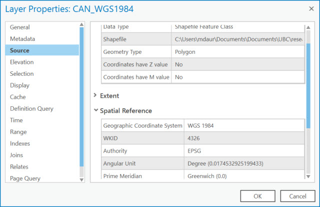

## Exercise 1: What coordinate system is my data in?

*1*{: .circle .circle-blue} In the project you just opened, make sure you are in the map tab **WGS1984**.

In ArcGIS Pro, each map is automatically loaded with a default topographic basemap, which takes on the coordinate system of the first dataset added to the map.

### Inspecting the Metadata

**Metadata** is data about data.  Let's look at the metadata (*i.e. properties*) of the dataset to learn a bit about it.

*2*{: .circle .circle-blue} Right-click the data in the Contents pane and select **Properties**.

*3*{: .circle .circle-blue} Under the **Source** tab, expand the **Spatial Reference** section and note what is listed for **Geographic Coordinate System** and **Angular Unit**.

In the next exercise we'll go over projection on-the-fly.
