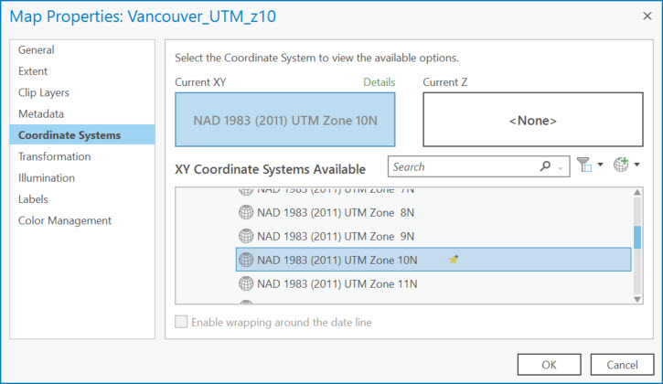

## Exercise 3: Project Your Data

*1*{: .circle .circle-blue} Open the **Vancouver UTM Z10** map tab.

Reset the data source if necessary.

We want to project this data from a geographic into a projected coordinate system using a projection that is more appropriate for this area.

The standard projection used by the City of Vancouver is called **Universal Transverse Mercator (UTM) Zone 10**.

The UTM projection divides the earth into 60 zones as a system for assigning coordinates to locations on the surface of the earth.

<figure>
  
  <figcaption><a href="https://www.nrcan.gc.ca/earth-sciences/geography/topographic-information/maps/utm-grid-map-projections/utm-grid-universal-transverse-mercator-projection/9779/">The sixteen zones covering Canada in the UTM projection,</a> Government of Canada.</figcaption>
</figure>

&nbsp;

Sixteen zones, from 7 to 22, cover Canada, and Vancouver falls in Zone 10 North. The zones are differentiated according to the northern and southern hemispheres.

You can read more about the [UTM Grid](https://www.nrcan.gc.ca/earth-sciences/geography/topographic-information/maps/utm-grid-map-projections/utm-grid-universal-transverse-mercator-projection/9779) and also [here](https://gisgeography.com/utm-universal-transverse-mercator-projection/).

*2*{: .circle .circle-blue} With the **cityVan_UTMz10** layer highlighted in **Contents**, click on the **View** tab at the top of your screen and select **Geoprocessing**.

This will open the **Geoprocessing** pane on the right side of your screen.

*3*{: .circle .circle-blue} Type **Project** in the search bar and click on **Project (Data Management Tools)** in the results below.

This formatting is letting you know that **Project** is a tool located in the **Data Management** toolbox.

You should now see a new window representing the parameters necessary to run the **Project** tool.

*4*{: .circle .circle-blue} In the first parameter box, click the dropdown arrow and select **cityVan_WGS1984**.

The input coordinate system is automatically populated.

*5*{: .circle .circle-blue} In the **Output Dataset** box, click the folder next to it and navigate to your shapefiles folder and name the output dataset **cityVan_UTMz10.shp**.

*6*{: .circle .circle-blue} Click on the sphere to the right of the **Output Coordinate System** window to select a coordinate system.

*7*{: .circle .circle-blue} Click on **Projected Coordinate System** to expand this menu and then *UTM> North America> NAD 1983 (2011) UTM Zone 10N*.

*8*{: .circle .circle-blue} Click on the star to the right of this coordinate system box to add this projection to your favourites, making it easier to use again in the future.

*9*{: .circle .circle-blue} Click **OK** and accept the default transformation populating the **Geographic Transformation** parameter.

*10*{: .circle .circle-blue} click **Run** at the bottom of the pane.

When it is done running, it will say **Project completed** and have a green checkmark next to it when the tool is done running.

The new projected dataset will be added to your map.

### *Reflection Question*
(Click the text for the answer)

Why does it still look like it's in a GCS and it's units are appearing in decimal degrees?

_This is because the data frame, or map, is in WGS1984, and ArcGIS Pro is projecting the data on-the-fly to line up with the data frame properties._

 

*11*{: .circle .circle-blue} Double-click on the map name in the **Contents** pane to open the data frame properties.

*12*{: .circle .circle-blue} Under the **Coordinate Systems** section, select the **NAD 1983 (2011) UTM Zone 10N** from your favourites and click **OK**.

You should see the data transform before your eyes.

It's not important to always know what projection you should be using.

You can google this information or consult a GIS person at the Research Commons.

What's more important is:
- that you think to examine a dataset's coordinate system information
- that if your data "doesn't look right" or is not lining up with other data there is likely a projection issue
- that you understand the complexity of mapping a 3-dimensional, irregular surface on a 2-dimensional plane
