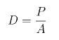
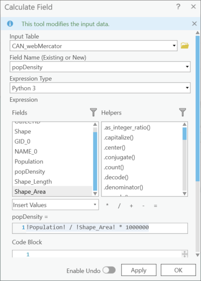

## Exercise 4: Calculating Population Density

***
Created with contributons from June Skeeter.

***

Your choice of map projection can affect the accuracy of your analysis. This exercise will demonstrate how different projections affect aereal analysis using population density (D), which is calculated using the formula below, where (P) represents population and (A) is the area.

*1*{: .circle .circle-blue} Go to the **Population Density** map tab and reset the data sources for the layers in the map if necessary by navigating to the mapProjections.gdb and respective feature datasets within.

A Feature Dataset is: a collection of feature classes within a geodatabase that have common properties (eg. projections). When we create a feature dataset, we can specify a projection. Then any layer we add to the feature dataset, will be re-projected to match.

*2*{: .circle .circle-blue} Right-click the **CAN_webMercator** layer in the **Contents** pane and select **Attribute table** to open it.

This layer is in the WGS 1984 Web Mercator Auxiliary Sphere projection, which is used in many web mapping applications, including Google Maps and ArcGIS Online.

*3*{: .circle .circle-blue} Open the attribute table for the **CAN_albersEA** layer too, which is in the Canada Albers Equal Area Conic projection. Recall that this projection preserves area.

*4*{: .circle .circle-blue} Right-click on the tab of one of the open attribute tables and select **New Horizontal Tab Group**. This will stack the two tables on top of one another so you can view the fields in each table at the same time.

The Population field, representing the approximate population of Canada, has been calculated for you. The Shape_Area field is automatically calculated by the software for feature classes (but not shapefiles). The area represents the area of Canada in meters, and the population field is the approximate population of Canada.

### *Reflection Question*
(Click the text for the answer)

Why are the numbers representing area different for the two projections?

<i>The Web Mercator projection does not minimize distortion except for shape, and measurements are most accurate close to the standard parallel, which is the Equator, and less accurate the farther away you get from this line.</i>

 

See this [Measuring distances and areas when your map uses the Mercator projection](https://www.esri.com/arcgis-blog/products/arcgis-enterprise/mapping/measuring-distances-and-areas-when-your-map-uses-the-mercator-projection/) blog post for further explanation about the follies of measuring distances and areas in Web Mercator.

Let's calculate the population density for these two layers.

*5*{: .circle .circle-blue} Right-click on the **popDensity** field in the **CAN_webMercator** attribute table and select **Calculate Field**.

*6*{: .circle .circle-blue} In the **Calculate Field** window, double-click on **Population**, single-click the backslash, double-click **Shape_Area**, and add the asterisk and 1000000 to convert the units to population per square kilometre. Click **OK**.

*7*{: .circle .circle-blue} Calculate the population density for the **CAN_albersEA** layer following the same steps.

Notice how different the two numbers representing population density are for the two layers in different projections.

### *Reflection Question*
(Click the text for the answer)

Which population density number is more accurate and why?

Because the Canada Albers Equal Area Conic projection preserves area, it is the more appropriate projection to use to make a calculation that involves area.

 
