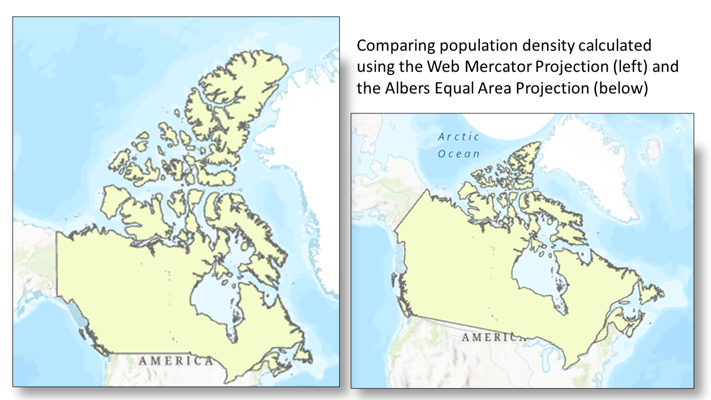
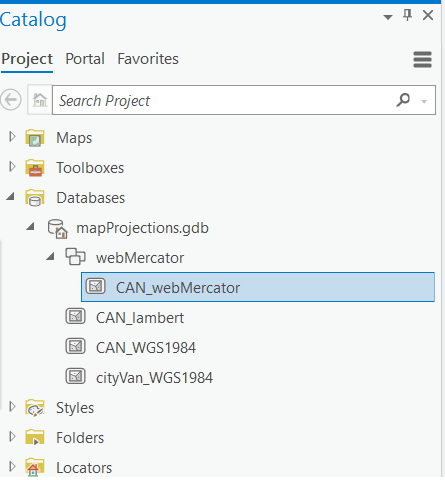

## Exercise 4: Calculating Population Density

Created by June Skeeter.

***

Your choice of map projection can affect the accuracy of your analysis. This exercise will demonstrate how different projections affect areal analysis using population density (D), which is calculated using the formula below, where (P) represents population and (A) is the area.

*1*{: .circle .circle-blue} Go to the **Population Density** map tab.

*2*{: .circle .circle-blue} Expand the **webMercator** Feature Dataset to see the **CAN_webMercator** layer inside it.

* A **Feature Dataset** is: a collection of feature classes within a geodatabase that have common properties (eg. projections). When we create a feature dataset, we can specify a projection. Then any layer we add to the feature dataset, will be re-projected to match.  This is a very useful feature to help keep everything organized.

### Create a new Feature Dataset

*3*{: .circle .circle-blue} In the catalog pane, right click on the mapProjections.gdb and select "New Feature Dataset".  Name it "Albers" and make sure to set the coordinate system to "Canada Albers Equal Area Conic".  See the video below for reference.

*4*{: .circle .circle-blue} Right click the newly created Albers feature dataset and select Import > Feature Class.  Then import the **CAN_webMercator** layer, renaming it as **CAN_albersEA**.  The layer will be automatically re-projected from the Web Mercator projection to the Canada Albers Equal Area Conic projection.

* Note the projection of the **Map Frame** is still in the WebMercator.  If you'd like to change it to the ALbers projection, follow the steps outlined in [Exercise 3](exercise3-project.md#change-the-map-frames-projection).  

  <iframe src="../videos/FeatureDataset.mp4" title="Processes" scrolling="no" frameborder="0"
    style="border: 0;
   height: 100%;
   left: 0;
   position: absolute;
   top: 0;
   width: 100%;">
   
Your browser does not support iframes.

 </iframe>

<a href="../videos/FeatureDataset.mp4" target="_blank">View Image in New Tab</a>

### Inspect the Attribute Tables

*5*{: .circle .circle-blue} Right-click the **CAN_webMercator** layer in the **Contents** pane and click **Attribute table** to open it.

This layer is in the WGS 1984 Web Mercator Auxiliary Sphere projection, which is used in many web mapping applications, including Google Maps and ArcGIS Online.

*6*{: .circle .circle-blue} Open the attribute table for the **CAN_albersEA** layer too, which is in the Canada Albers Equal Area Conic projection. Recall that this projection preserves area.

*7*{: .circle .circle-blue} Right-click on the tab of one of the open attribute tables and select **New Horizontal Tab Group**. This will stack the two tables on top of one another so you can view the fields in each table at the same time.

The Population field represents the approximate population of Canada as of the 2021 Census. The Shape_Area field is automatically calculated by the software for feature classes (but not shapefiles). The area represents the area of Canada in meters.

### *Reflection Question*
(Click the text for the answer)

Why are the numbers representing area different for the two projections?

<i>The Web Mercator projection does not minimize distortion except for shape, and measurements are most accurate close to the standard parallel, which is the Equator, and less accurate the farther away you get from this line.</i>

 

See this [Measuring distances and areas when your map uses the Mercator projection](https://www.esri.com/arcgis-blog/products/arcgis-enterprise/mapping/measuring-distances-and-areas-when-your-map-uses-the-mercator-projection/) blog post for further explanation about the follies of measuring distances and areas in Web Mercator.

### Calculating Population Density

*8*{: .circle .circle-blue} Create a new field in the **CAN_webMercator** layer called **popDensity**.  To do this, in the top left of the attribute table select Field:**Add**.  In the tab that opens, name the field popDensity, **make sure** to change the type to **float** (this data type allows for decimals).  Then **save** the field.  Refer to the video for guidance.

  <iframe src="../videos/newField.mp4" title="Processes" scrolling="no" frameborder="0"
    style="border: 0;
   height: 100%;
   left: 0;
   position: absolute;
   top: 0;
   width: 100%;">
   
Your browser does not support iframes.

 </iframe>

<a href="../videos/newField.mp4" target="_blank">View Image in New Tab</a>

*9*{: .circle .circle-blue} Right-click on the **popDensity** field in the **CAN_webMercator** attribute table and select **Calculate Field**.

*10*{: .circle .circle-blue} In the **Calculate Field** window, double-click on **Population**, single-click the backslash, double-click **Shape_Area**, and add the asterisk and 1000000 to convert the units to population per square kilometer. Click **OK**.

*11*{: .circle .circle-blue} Calculate the population density for the **CAN_albersEA** layer by repeating steps 8-10 for this layer.

Notice how different the two numbers representing population density are for the two layers in different projections.

### *Reflection Question*
(Click the text for the answer)

Which population density number is more accurate and why?

Because the Canada Albers Equal Area Conic projection preserves area, it is the more appropriate projection to use to make a calculation that involves area.

 
