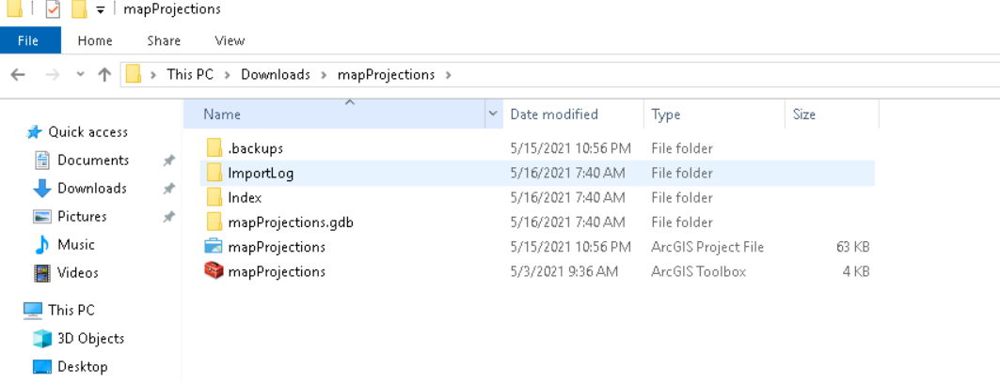

## Exercises

These exercises will be accomplished using [ArcGIS Pro](https://www.esri.com/en-us/arcgis/products/arcgis-pro/overview). You should have already downloaded the software and the data we will use for this workshop.

If you don't have access to the software, that's okay, you can just watch.

If you haven't already downloaded the data, you can find it here:

[Download](https://github.com/ubc-lib-geo/map-projections-data/raw/main/projections-workshop-data-v1.zip){: .btn .btn-blue }

Download the data and extract the compressed files into your Downloads folder.  You will see a mapProjections folder.  Open this folder and you will see:

Double click the mapProjections ArcGIS Project File.  This will open a project in ArcGIS Pro that has already been setup for you.

These exercises will help demonstrate how to apply these different concepts we have been talking about to working with spatial data.

These exercises will address:

- How to recognize whether your data is in a geographic coordinate system
- How to find the spatial reference system of your dataset in that dataset's properties
- Projection on-the-fly and changing the projection properties of your data
- How projection impacts analysis

#### Exercise 1: What Coordinate System is my Data In?

#### Exercise 2: Projecting On-the-Fly

#### Exercise 3: Project Your Data

#### Exercise 4: Calculating Population Density
