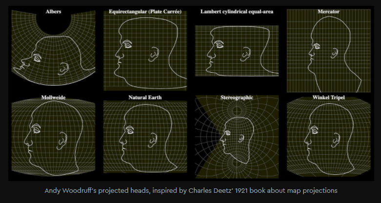

## Introduction

This introductory video will set the stage for what this workshop is all about.

[Why all world maps are wrong](https://www.youtube.com/watch?v=kIID5FDi2JQ)

### Key Points From the Video

* The surface of a sphere cannot be represented as a plane without distortion.
* A projection is the process by which we translate (or project) the spherical globe onto a flat surface.
* The object onto which maps are projected (i.e. cylinder, cone, or plane) affects the way the map appears.
* All map projections maintain certain properties while distorting others.
* Map projections can be useful, but they can also be misleading.

<figure>
  
  <figcaption><a href="https://www.mapbox.com/blog/adaptive-projections">Conceptual drawings showing different forms of distortion as a result of different projections.</a> Source: Vladimir Agafonkin/Mapbox.</figcaption>
</figure>

&nbsp;

### *Reflection Question*
(Click the text for the answer)

Who remembers which projection Google Maps uses and why?

<i>Web Mercator
 
- Wherever you are on the map, up and down are north and south and left and right are west and east
 
- Preserves angles of roads
 
- At large scales, the conformality of the projection preserves shapes, such as buildings
 
- Objects around the equator are to scale relative to one another, while objects closer to the poles appear larger than they really are</i>

 

This projection became widespread when web cartography became commonplace because interactive maps centered on street-level navigation. This projection does not work as well on a global scale, however. Our web maps have evolved to cover more area across the globe in one map, but our use of different projections to accommodate this shift has not. Read more about this challenge and Mapbox's [Adaptive Projections](https://www.mapbox.com/blog/adaptive-projections) solution.

If you're interested in reading more about this projection and some of the criticisms associated with using it, check out this Esri blog [It's Not Hip to Be Square](https://www.esri.com/arcgis-blog/products/arcgis-pro/mapping/mercator-its-not-hip-to-be-square/).

### *Reflection Question*
(Click the text for the answer)

What are the four properties that are either preserved or distorted depending on the projection?

 
<i>Shape (angle), size (area), direction, and distance<i>

